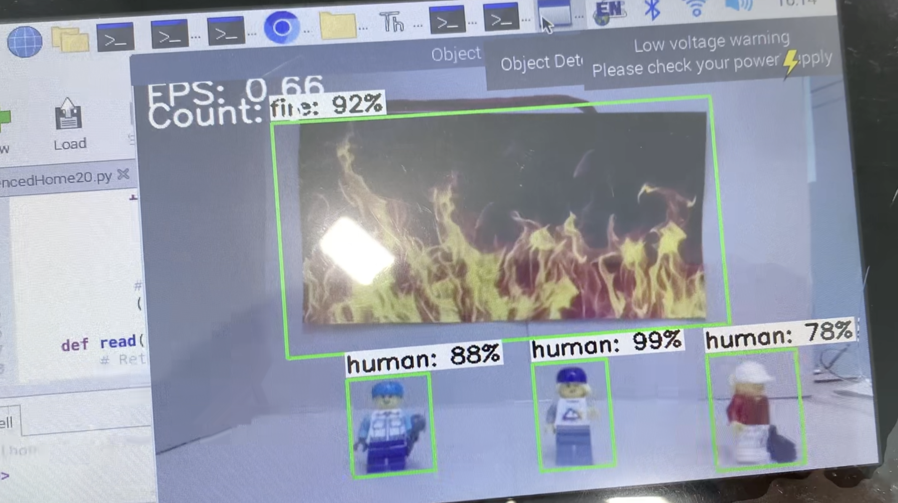
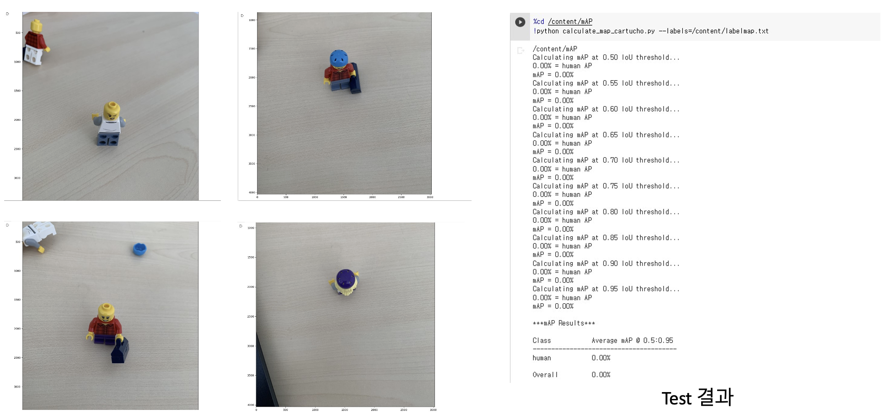
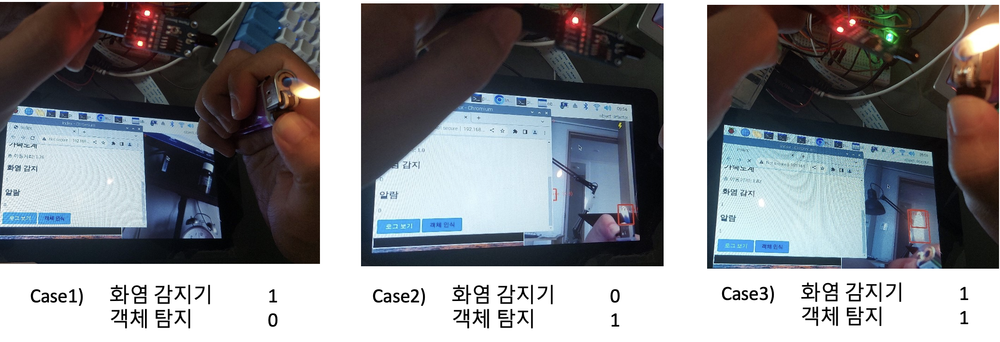
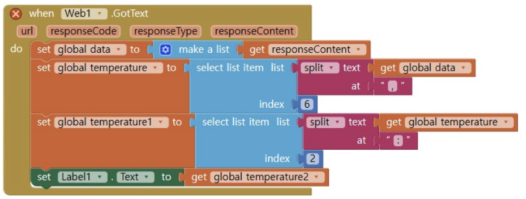
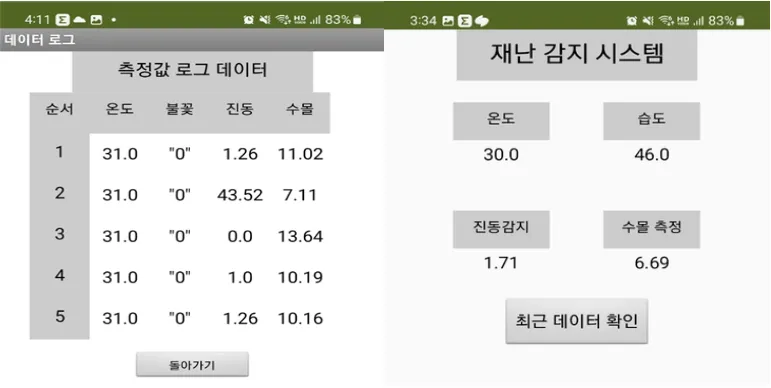
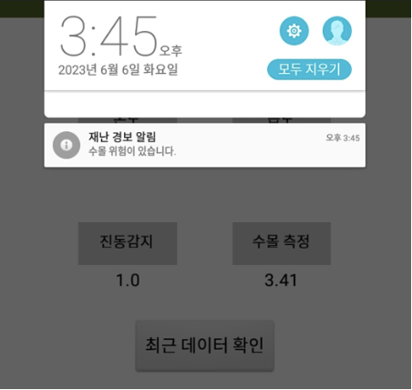

### 프로젝트 소개
---
사고 발생에 취약한 공간에 시스템을 구축하여 애플리케이션을 통해 사용자들에 재난 관련 정보 및 실시간 모니터링을 제공하는 시스템

### 프로젝트 개요
---
**배경**
2022년, 태풍 힌남노의 영향으로 포항 아파트 지하 주차장에서의 7명의 사상자 발생, 10월 이태원 압사 사고 등 각종 재난 사건들로 인해 수많은 인명 피해가 발생하였습니다. 이를 통해 예상치 못한 시간 및 장소에서 발생하는 재난 사고를 대비하는 시설물이나 경보 시스템이 부족하다고 생각하여 프로젝트를 기획하였습니다.

**목적**
인구 밀집 구역 및 지하주차장과 같이 사고 발생에 취약한 공간에 시스템을 구축하고 애플리케이션을 통해 사용자들에게 관련 정보 및 모니터링 시스템을 제공하는 것을 목표로 하였습니다.

### 기술
---
1. 객체 인식 - OpenCV, Raspberrypi 3b+, tensorflow lite
    1. 불, 사람 이미지를 각각 라벨링하여 데이터셋을 구축
        
    2. OpenCV 내의 CNN 모델인 EfficientDet-D0으로 데이터셋을 학습시켜 TFLite 파일을 생성. 라즈베리파이 내에서의 객체 감지 추론 수행
2. 센서 모듈을 통한 카메라 오차값 보정 및 재난 측정
    1. 불꽃 감지 센서(SZH-EK086) 및 온습도 센서(DHT11)의 측정값 데이터와 객체 감지를 통해 인식된 불꽃이 동시에 존재할 때 최종적으로 화재가 발생했다고 판단하는 근거로 사용
        
    2. 초음파 센서(HC-SR04)를 기기 하단에 부착하여 수위 상승을 감지
    3. Web - Flask
        1. 사용자에서 알림을 보낼 애플리케이션에 필요한 데이터를 저장하고 수집된 데이터 로그를 보여주기 위함
        2. ngrok 방식을 통해 flask 서버의 데이터들을 애플리케이션으로 내보낼 수 있도록 함
    4. App Inventor
        1. Flask 서버의 데이터 json 형태로 요청하여 각 label에 저장하고 최신 순서대로 로그 데이터 값을 표기함
            
            
        2. 재난 발생 시 팝업창과 함께 알림이 울림

            